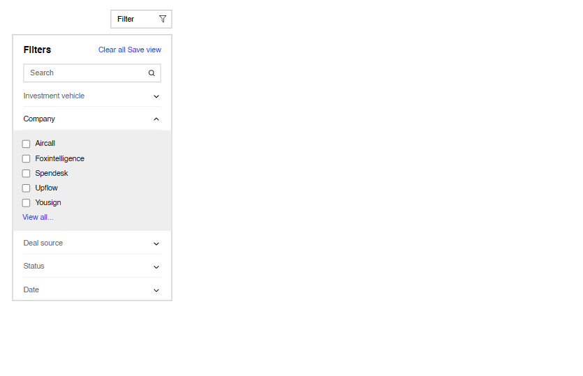

# Click Solutions Testaufgabe
## Filterpanel Komponente

## Features
<ul>
    <li>"Filter" Button klappt Filterpanel aus</li>
    <li>Toolbar
        <ul>
            <li>"Clear all" Button setzt alle ausgewählten Filter zurück</li>
            <li>"Save view" liest ausgewählte Filter in Konsole aus und schließt das Panel</li>
        </ul>
    </li>
    <li>Suchfilter mit Textinputfeld</li>
    <li>Accordions
        <ul>
            <li>Klappen bei Klick Filteroptionen aus</li>
            <li>Bei mehr als 5 Optionen pro Filterkategorie erscheint "View all..." als Platzhalter</li>
            <li>Alle Optionen bei Klick auf "View All..."</li>
        </ul>
    </li>
</ul>

## Tech Stack
**Markup:**  
  
**Styling:**  
  
**Programming language:**  
  
**IDE:**  
  
**Version Control:**  
  
